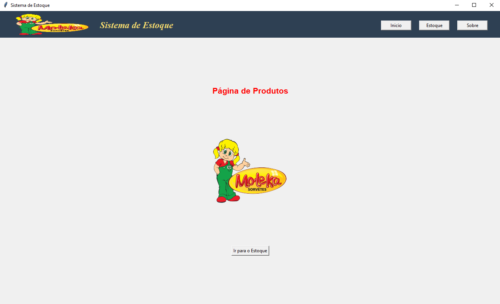
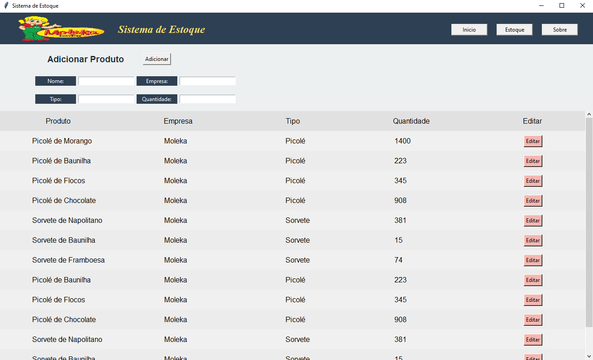

# 🛑Sistema de Estoque🛑


## Sobre o projeto

Este projeto é uma aplicação de gerenciamento de estoque desenvolvida em Python com a biblioteca **Tkinter** para interface gráfica. Ele permite adicionar, editar, excluir e visualizar produtos no estoque de uma empresa. Os dados dos produtos são armazenados em um banco de dados SQLite, garantindo persistência e confiabilidade na gestão do estoque.

## Índice

- [Sobre o projeto](#sobre-o-projeto)
- [Funcionalidades](#📱funcionalidades)
- [Layout](#🖥️layout)
- [Como executar o projeto](#👨🏽‍💻como-executar-o-projeto)
  - [Pré-requisitos](#pré-requisitos)
  - [Passo a Passo](#passo-a-passo)
- [Tecnologias](#🛠️tecnologias)
- [Como contribuir para o projeto](#como-contribuir-para-o-projeto)
- [Autores](#🧙‍♂️autores)
- [Licença](#📝licença)

## 📱Funcionalidades

- [x] **Adicionar Produto**: Adiciona novos produtos ao estoque com informações detalhadas.
- [x] **Editar Produto**: Permite modificar as informações de um produto existente.
- [x] **Excluir Produto**: Remove um produto do banco de dados com confirmação.
- [x] **Visualizar Produtos**: Exibe todos os produtos cadastrados com informações de nome, tipo, quantidade e empresa.
- [x] **Interface Gráfica Intuitiva**: Navegação fácil e clara com botões e menus organizados.

## 🖥️Layout

O layout conta com uma interface gráfica simples e funcional, com um menu superior para navegação e frames para visualização e manipulação de dados de produtos no estoque.




## 👨🏽‍💻Como executar o projeto

### Pré-requisitos

- **Python 3.x** instalado na máquina.
- **Tkinter** (geralmente já incluído com o Python).
- **SQLite** para o banco de dados.

### Passo a Passo

1. Clone o repositório:

    ```bash
    git clone https://github.com/KaiqueLima3001/Project_Python.git
    ```

2. Acesse o diretório do projeto:

    ```bash
    cd Project-Python\ v2/
    ```

3. Execute o arquivo principal para iniciar a aplicação:

    ```bash
    python main.py
    ```

## 🛠️Tecnologias

- **Python** - Linguagem principal
- **Tkinter** - Biblioteca para a interface gráfica
- **SQLite** - Banco de dados para armazenamento de dados

## Como contribuir para o projeto

1. Faça um fork deste repositório.
2. Crie uma branch com sua feature (`git checkout -b minha-feature`).
3. Faça commit das suas alterações (`git commit -m 'Minha nova feature'`).
4. Envie para a branch principal (`git push origin minha-feature`).
5. Abra um Pull Request para revisão.

## 🧙‍♂️Autores

<div style="display: flex; justify-content: space-around; align-items: center;">
  <div style="text-align: center; margin: 0 10px;">
    
    <br/>
    <a href="https://github.com/KaiqueLima3001">Kaique Lima</a>
    <br> 
  </div>
  
  <div style="text-align: center; margin: 0 10px;">
    
    <br/>
    <a href="https://github.com/VitorLamoya">Vitor Lamoya</a>
    <br> 
  </div>
  
  <div style="text-align: center; margin: 0 10px;">
    
    <br/>
    <a href="https://github.com/phbarboza99">Pedro Henrique</a>
    <br> 
    
  </div>
</div>


## 📝Licença

Feito pelos 3 autores acima. [Entre em contato!](https://mail.google.com/mail/u/0/?view=cm&fs=1&tf=1&to=kaiquelima3001@gmail.com,lamoyav@gmail.com&su=Contato%20sobre%20o%20projeto&body=Olá%20autores%2C%20)


